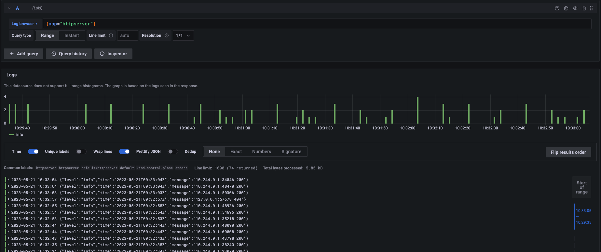
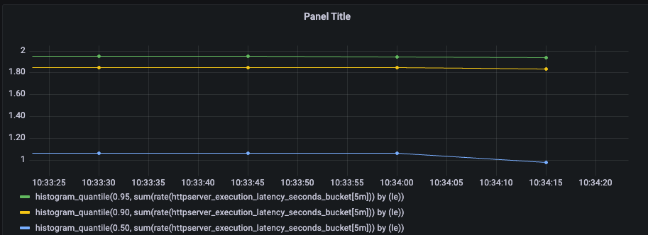

# httpserver - A simple HTTP server

## New features of httpserver
	- Add random delay and Prometheus metrics in metricsMiddleware
	- Logs will also be written to stdout now to be collected by Loki

## Features
- Collect metrics with Prometheus
- Collect logs with Loki
- View various metrics in both Prometheus and Grafana
- View logs with Loki in Grafana

## Loki-stack installation

### Download loki-stack

```sh
helm pull grafana/loki-stack
tar -xvf loki-stack-*.tgz
cd loki-stack
```


To install loki-stack on Kubernetes v1.22+, we need to change rbac.authorization.k8s.io/v1beta1 to rbac.authorization.k8s.io/v1. Therefore, manual installation is required:

```sh
grep -rl "rbac.authorization.k8s.io/v1beta1" . | xargs sed -i 's/rbac.authorization.k8s.io\/v1beta1/rbac.authorization.k8s.io\/v1/g'
 sed s#rbac.authorization.k8s.io/v1beta1#rbac.authorization.k8s.io/v1#g *.yaml
```

### Install loki locally

```sh
helm upgrade --install loki ./loki-stack --set grafana.enabled=true,prometheus.enabled=true,prometheus.alertmanager.persistentVolume.enabled=false,prometheus.server.persistentVolume.enabled=false
```


### Deploy the httpserver pod and service

```sh
kubectl apply -f httpserver-deploy.yaml
kubectl apply -f httpserver-service.yaml
```


### Demo
Loki logs:


Prometheus metrics:


