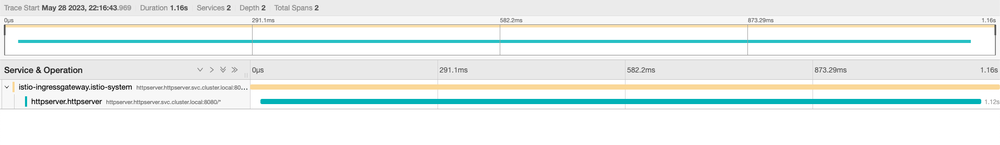

# httpserver - A simple HTTP server

## New features of httpserver
	- Use Istio Ingress Gateway and Virtual Service to expose the service
	- Apply Istio Destination Rule to enable mutual TLS between the client and the server
	- Enable tracing with Jaeger


## Deploy httpserver

```sh
kubectl create ns httpserver
kubectl label ns httpserver istio-injection=enabled
kubectl apply -f httpserver -n httpserver
```

## Deploy Istio IngressGateway and VirtualService with TLS

```sh
openssl req -x509 -sha256 -nodes -days 365 -newkey rsa:2048 -subj '/O=cncamp Inc./CN=*.cncamp.io' -keyout cncamp.io.key -out cncamp.io.crt
kubectl create -n istio-system secret tls cncamp-credential --key=cncamp.io.key --cert=cncamp.io.crt
kubectl apply -f istio-specs.yaml -n httpserver
```
### Enable tracing
```
kubectl apply -f  jaeger.yaml
```

## Check ingress ip
```sh
k get svc -nistio-system

istio-ingressgateway   LoadBalancer   $INGRESS_IP
```


## Access the httpserver via ingress

```sh
curl --resolve httpsserver.cncamp.io:443:$INGRESS_IP https://httpsserver.cncamp.io/healthz -v -k
```


## Open tracing with Jaeger

```sh
istioctl dashboard jaeger
```


### Demo
