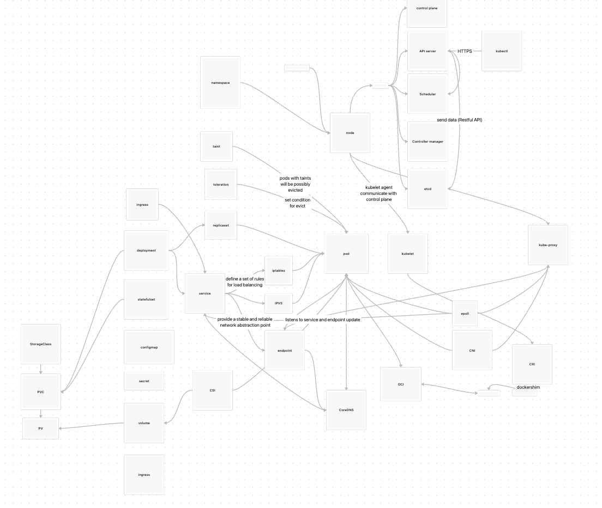

# 总结
通过课程我掌握了k8s集群的基本应用，理解了各种重要的概念，比如pod，service，deployment，statefulset，ingress，configmap，secret，pv，pvc，namespace，node等等，以及它们之间的关系。
除此之外在孟老师庖丁解牛式的教学内容中，了解k8s的核心运行机制，还有生产环境一些问题的解决方案。这是其他云原生课程所缺乏的，孟老师在这方面讲得很详尽。
课堂之外，我还通过作业时间学会了简单的k8s集群部署应用，以及通过istio实现简单的流量管理等。
在课程期间我也做了笔记，记录了一些重要的知识点并做成思维导图。s

15周的课程上完了。不过感觉这不是结束，而是一个开始。因为很多视频都是囫囵吞枣地看，并没有深入跟着做一遍。在作业翻看相关视频时候，才发现有很多知识点都忽略了。所以之后有时间会把重要或者感兴趣的视频看一遍。相关事例再跟着做一遍。

## 建议
孟老师的课程很好，很多知识点都是在实际项目中用到的，所以很有用。但是作为初学者，觉得课程内容安排可能有点密集，有些知识点还是需要自己去查阅资料，多练习才能掌握。
如果能够把课程大纲中每节课按照难易程度标记出来,应用和原理分开讲，让初学者更好地掌握课程进度会更好。另外课件中的内容比较零散，有些知识点需要自己去查阅资料，希望能够把课件中的知识点整理成一份文档，方便查阅。

